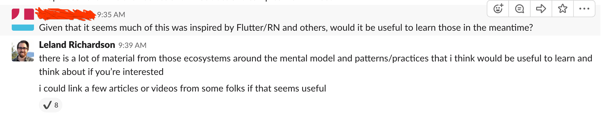

If you haven't yet watched the [session on Declarative UI Patterns](https://www.youtube.com/watch?v=VsStyq4Lzxo), you should do that now. It is a proper overview of the motivations and goals behind the Jetpack Compose project that Google unveiled last week at Google I/O 2019.

<iframe 
  style="width:100%;height:320px;" 
  src="https://www.youtube.com/embed/VsStyq4Lzxo" 
  frameborder="0" 
  allow="accelerometer; autoplay; encrypted-media; gyroscope; picture-in-picture" 
  allowfullscreen
></iframe>

Compose is an ambitious multi-team effort to reimagine Android's UI Toolkit more than 10 years after the Android Platform launched with the original UI Toolkit.

Compose is _extremely early_. It is currently "pre-alpha" (if that's a thing?), which essentially means that it's nowhere near done, pretty much everything is subject to change, and we make absolutely no guarantees around API stability. For now, we ask that you **do NOT use Compose in your production apps until we say it is ready**.

One might ask:

_If this is the case, why even open source it?_

One reason we decided to open source Compose in such an early state is because in many ways, moving over to it will represent a **paradigm shift in terms of UI development on Android**, and we wanted to get the community used to the ideas embodied by this new framework.

Keep in mind, however, that if all of this talk of change overwhelms you or concerns you, _don't worry_. There is _no need for you to learn any of this now_, and there is a long time between now and when Compose will be the default way to do Android UI development.

I am planning on writing several blogs about Compose's architecture and doing technical deep dives around parts of the architecture that I think are interesting or useful for the community to understand. Writing takes time though, and some of these first articles I want to make sure and get right! In the meantime, there seems to be a lot of interested folks in the Android community that are eager to understand more about this new direction.

A few people have asked me what kind of things they can read or watch to better understand the programming model of Compose in the meantime. Compose has been influenced by many existing frameworks including, but not limited to, [React](https://reactjs.org/), [Litho](https://fblitho.com/), [Vue](https://vuejs.org/), and [Flutter](https://flutter.dev/). As many already know, I have a strong background with the React community, so I thought I would put together a list of links to talks or articles from folks in the React community that have really influenced my thinking around these paradigms.

I think these should be helpful to those looking to really understand the programming model of Compose. While Compose is architecturally pretty different from React in terms of implementation, the programming model and mental model are very similar.

## Rethinking Best Practices - Pete Hunt

<iframe 
  style="width:100%;height:320px;" 
  src="https://www.youtube.com/embed/x7cQ3mrcKaY" 
  frameborder="0" 
  allow="accelerometer; autoplay; encrypted-media; gyroscope; picture-in-picture" 
  allowfullscreen
></iframe>

I believe this was the 2nd public talk given about React. The first public talk announcing react was met with a lot of skepticism and public backlash. This talk does a great job describing the thinking behind React, and the problems it solves, at a time where writing UI in the way that you do with React was very new and not well understood. Keep in mind while watching this that it is directed primarily at a “web” crowd.

## Why does React Scale? - Christopher Chedeau

<iframe 
  style="width:100%;height:320px;" 
  src="https://www.youtube.com/embed/D-ioDiacTm8" 
  frameborder="0" 
  allow="accelerometer; autoplay; encrypted-media; gyroscope; picture-in-picture" 
  allowfullscreen
></iframe>

This talk goes over some of the thinking behind React's architecture that has been done specifically to make React scale for large organizations (solving the problems that facebook has). Some interesting points that you might not think of out of the bat.

## ‹Rethinker stop={false}/› - Ryan Florence

<iframe 
  style="width:100%;height:320px;" 
  src="https://www.youtube.com/embed/kp-NOggyz54" 
  frameborder="0" 
  allow="accelerometer; autoplay; encrypted-media; gyroscope; picture-in-picture" 
  allowfullscreen
></iframe>

This is a great talk given by Ryan Florence that demonstrates some new ways to think about using React and creating pleasant APIs. Good demonstration and good discussion from a great public speaker.

## Functional Principles In React - Jessica Kerr

<iframe 
  style="width:100%;height:320px;" 
  src="https://www.youtube.com/embed/1uRC3hmKQnM" 
  frameborder="0" 
  allow="accelerometer; autoplay; encrypted-media; gyroscope; picture-in-picture" 
  allowfullscreen
></iframe>

If you're not super familiar with functional programming, or maybe even you are, but it's not clear why React is “functional” (it kind of looks like OOP), this is a great talk to explain the “functional” side of react, and why it's a good thing. The concepts for Compose are somewhat similar, though Compose utilizes functions as Components whereas React's functions at the time of this talk were stateless.

## Pure UI - Guillermo Rauch

[Link](https://rauchg.com/2015/pure-ui)

Great overview and explanation of the benefits of building UIs composed of components.

## Live React: Hot Reloading with Time Travel - Dan Abramov

<iframe 
  style="width:100%;height:320px;" 
  src="https://www.youtube.com/embed/xsSnOQynTHs" 
  frameborder="0" 
  allow="accelerometer; autoplay; encrypted-media; gyroscope; picture-in-picture" 
  allowfullscreen
></iframe>

This video was the announcement of [redux](https://redux.js.org/), which Dan Abramov made for this talk. It goes into a lot of the thinking behind it and how it was different from flux. He also demonstrates "hot reloading" and some really innovative developer tooling at the time.

## React Today and Tomorrow - Sophie Alpert and Dan Abramov

<iframe 
  style="width:100%;height:320px;" 
  src="https://www.youtube.com/embed/V-QO-KO90iQ" 
  frameborder="0" 
  allow="accelerometer; autoplay; encrypted-media; gyroscope; picture-in-picture" 
  allowfullscreen
></iframe>

This talk was given as an introduction to a recently added feature to React: Hooks. Compose has a concept similar to Hooks which we call Effects, though hooks themselves may end up unifying with `@Composable` functions. More on this later. In any event, the motivations behind them and the patterns they enable are important for React and will be for Compose as well.

## 90% Cleaner React With Hooks - Ryan Florence

<iframe 
  style="width:100%;height:320px;" 
  src="https://www.youtube.com/embed/wXLf18DsV-I" 
  frameborder="0" 
  allow="accelerometer; autoplay; encrypted-media; gyroscope; picture-in-picture" 
  allowfullscreen
></iframe>

This talk was given immediately after the former, and I think is a good introduction to using Hooks in practice and demonstrating their value. Some of the pain people are feeling here might be React-specific, but it's worth a watch regardless.

## A Complete Guide to useEffect - Dan Abramov

[Link](https://overreacted.io/a-complete-guide-to-useeffect/)

Hooks have a bit of a learning curve, requiring you to think of Function Components (and `@Composable` functions in Compose) in a little bit of a different light than traditional functions. Dan, as always, does an excellent job explaining how to think about these things, and in particular, the `useEffect` hook, which is analogous to the `onCommit` effect in Compose.

## React as a UI Runtime - Dan Abramov

[Link](https://overreacted.io/react-as-a-ui-runtime/)

This is an excellent medium-to-deep-dive on React's architecture, as well as a good overview of how to think different parts of the library working together. Not all of it maps directly to elements of Compose, but generally speaking I think it's a good primer if you're interested in learning more about this stuff.

## Cross-Language React - Me

<iframe 
  style="width:100%;height:320px;" 
  src="https://www.youtube.com/embed/eR4LjL1h6cE" 
  frameborder="0" 
  allow="accelerometer; autoplay; encrypted-media; gyroscope; picture-in-picture" 
  allowfullscreen
></iframe>

So I might be a little bit biased here but... this was a talk I gave right as I started working on Compose at Google, and it really is a talk about a project I was working on (building a React-like framework in Kotlin and Swift) before coming to Google. I go over some concepts here that I believe could be useful to those looking to understand Compose a bit better.

---

That's all I've got for now. There's a _ton_ of great material out there, and this is by no means an exhaustive list. These are just a few of the items that have been particularly impactful for me. I hope that some others might find it useful.

Stay tuned for some content from me talking about Compose's architecture directly!
